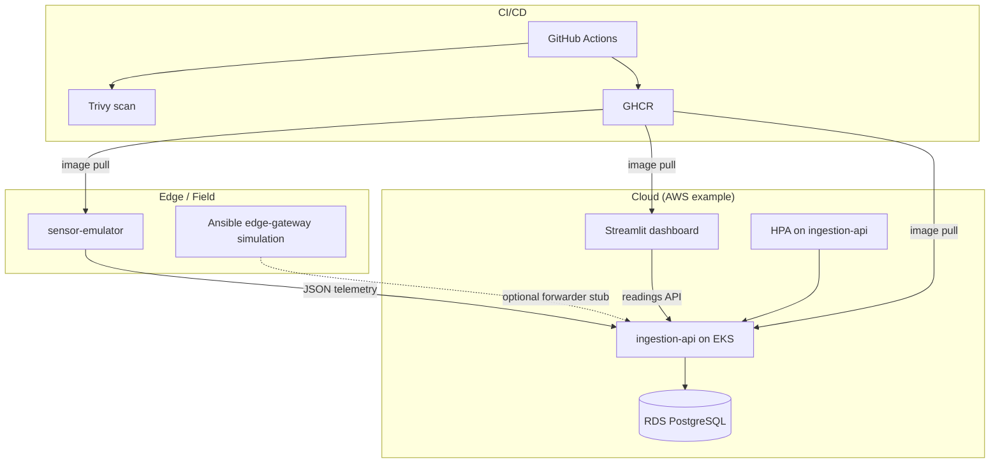

# GreenPulse

**GreenPulse** is a multi-region IoT edge analytics reference platform for precision agriculture. It ingests soil and crop telemetry (moisture, temperature, pH), persists it in PostgreSQL, and visualizes crop health in a live dashboard. The repository is structured as a monorepo with containerized microservices, Terraform modules for AWS (VPC, EKS, RDS), Kubernetes manifests (including HPA and probes), Ansible for an edge-gateway simulation, and a GitHub Actions pipeline for lint, test, image build, Trivy scanning, and optional cluster deployment.

## Proposed layout

```text
GreenPulse/
├── .github/
│   ├── workflows/main.yml
│   └── PULL_REQUEST_TEMPLATE.md
├── apps/
│   ├── sensor-emulator/       # Python telemetry generator
│   ├── ingestion-api/         # Go API + PostgreSQL
│   └── dashboard/             # Streamlit UI
├── docs/
│   └── CONTRIBUTING.md        # GitFlow + Conventional Commits
├── infrastructure/
│   ├── ansible/
│   ├── kubernetes/base/
│   └── terraform/
│       ├── modules/{vpc,eks,rds}
│       ├── backend.hcl.example
│       └── terraform.tfvars.example
├── docker-compose.yml
├── .env.example
├── .gitignore
└── README.md
```

## Architecture



**Multi-region posture:** Terraform in this repo provisions a single primary region (VPC + EKS + RDS). For true multi-region active-active or DR, replicate the same modules in a second workspace with another `aws_region`, front traffic with global load balancing or DNS failover, and replicate or stream telemetry (for example via regional ingestion endpoints). The diagram above shows the logical split between edge simulation and cloud services.

## Local development (Docker Compose)

1. Copy `.env.example` to `.env` and replace every placeholder with real values (for example export `POSTGRES_USER`, `POSTGRES_PASSWORD`, `POSTGRES_DB`, and a matching `DATABASE_URL`). **Do not commit `.env`.**
2. From the repository root:

```bash
docker compose up --build
```

3. Open the dashboard at `http://localhost:8501`. The ingestion API listens on `http://localhost:8080` (`GET /api/v1/readings`, `POST /api/v1/telemetry`). Health checks: `GET /health/live`, `GET /health/ready`.

## Kubernetes

Manifests live under `infrastructure/kubernetes/base` and are wired with **Kustomize**.

- **Secret:** create `greenpulse-db` in namespace `greenpulse` before rollouts succeed, e.g.  
  `kubectl create secret generic greenpulse-db --namespace=greenpulse --from-literal=DATABASE_URL='${DATABASE_URL}'`  
  or render `secret.example.yaml` with `envsubst` (see file header comments).
- Replace image prefixes `ghcr.io/PLACEHOLDER_ORG/...` with your registry path (GitHub Actions does this automatically via `kubectl set image`).
- Apply: `kubectl apply -k infrastructure/kubernetes/base`

Features demonstrated: **HPA** on `ingestion-api`, **liveness/readiness** probes on all workloads, and **Secret-backed** database credentials (no passwords in Deployment manifests).

## Terraform (AWS)

- Modules: `modules/vpc`, `modules/eks`, `modules/rds`.
- RDS master password is generated with `random_password` (sensitive output) — **not** hardcoded.
- **Remote state:** configure an S3 bucket and DynamoDB table for locking, copy `backend.hcl.example` to `backend.hcl`, replace `REPLACE_ME_*` placeholders, then run `terraform init -backend-config=backend.hcl`.
- **Azure alternative:** for Blob + native locking, use the `azurerm` backend in a fork or second root module; the pattern (remote state + lock) is the same even though this tree targets AWS.

Copy `terraform.tfvars.example` to `terraform.tfvars` (gitignored) or pass `-var` / `TF_VAR_*` for `aws_region`, `environment`, and `rds_master_username`.

## CI/CD (GitHub Actions)

Workflow: `.github/workflows/main.yml`

- Lints Python with **Ruff**, runs **pytest** for the emulator, and **Go tests** inside a container.
- Builds each Dockerfile, runs **Trivy** against the loaded image, and **pushes** to **GHCR** on pushes to `main` / `develop`.
- **Deploy:** on `main`, if repository secret `KUBE_CONFIG_B64` (base64-encoded kubeconfig) is set, applies Kustomize and runs `kubectl set image` to the commit SHA.

## Ansible edge simulation

See `infrastructure/ansible/playbook.yml` and copy `inventory.example.ini` to `inventory.ini` with your SSH settings (use `${EDGE_SSH_USER}` style placeholders in the example only; real values stay local).

## Version control

- **GitFlow** and **Conventional Commits** are documented in `docs/CONTRIBUTING.md`.
- Pull requests should use `.github/PULL_REQUEST_TEMPLATE.md`.

## Security

- No passwords or API keys are committed. Use environment variables, Kubernetes Secrets, Terraform sensitive outputs, and GitHub **encrypted secrets** for `KUBE_CONFIG_B64`.
- Container images use **multi-stage** builds with **Alpine/slim** (Python) and **distroless** (Go API).

## License

This reference project is provided for academic and portfolio use; add a license file if you redistribute it.
